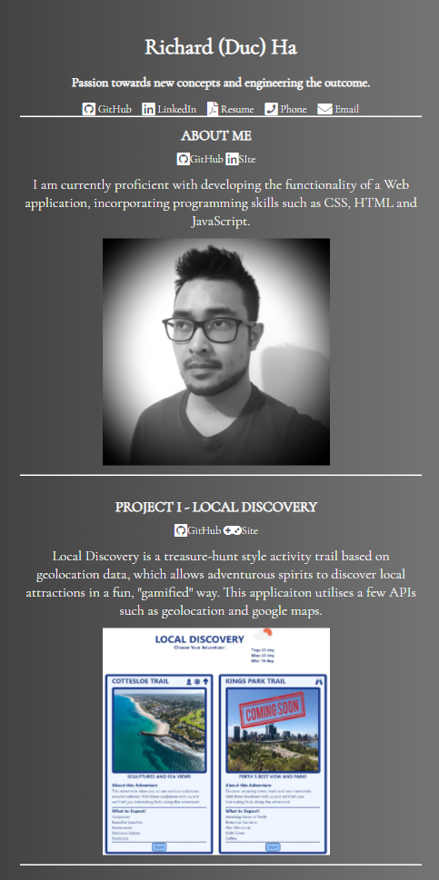
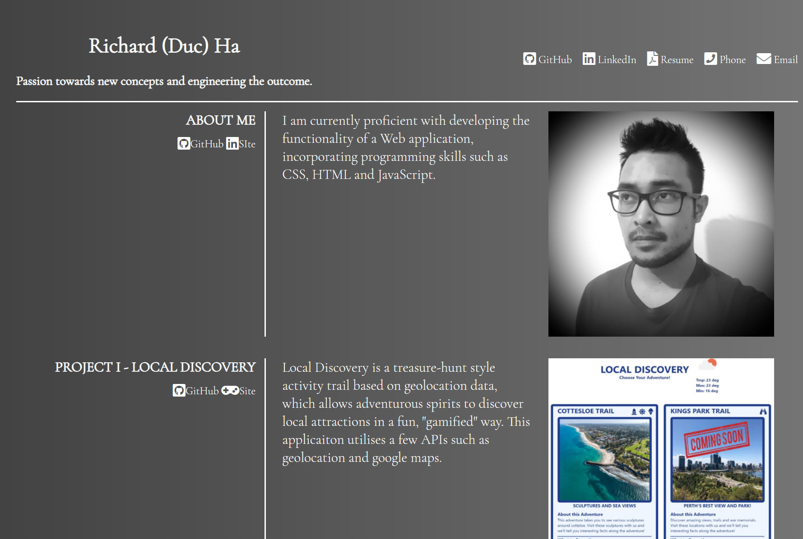

# portfolioHa

## Link to Deplyed Application:
https://richoha.github.io/portfolioHa/

## Link to GitHub:
https://github.com/RichoHa/portfolioHa

## List of Technology Used:
- CSS Disply Grid, Flex anad Block to make a responsive website.
- Media Queries to contribute to the responsive website.
- Easy templated format to make expanding the webiste easy.
- Font Awesome Icons to make the website more appealing.
- Utilised Hover feature for a more responsive website. 
- Chose a simple background color which is easy to look at.
- Utilised a clean looking font. 

## Purpose of the website:
The purpose of the website is to show people the progress of my
programming career and demonstrate the projects which I have conducted.

## Mobile ScreenShot

## Web Application ScreenShot

## Collaborators
Richard (Duc) Ha: 0404 545 580 or Richard.dqh@gmail.com.